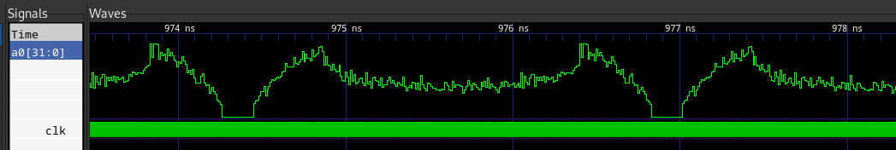
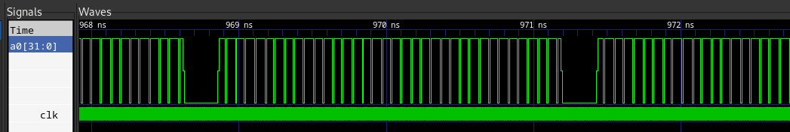
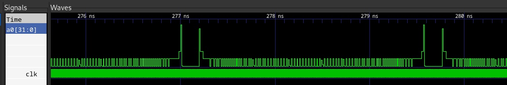

<center>

# Team 20: RISC-V CPU
RISC-V CPU Project for Imperial EIE 2023/24

---

**_Adam El Jaafari, Archisha Garg, Dimitris Alexopoulos, Toby Browne_**

---

</center>

## Personal Statements

- [**Adam El Jaafari**](doc/Adam%20El%20Jaafari.md)
- [**Archisha Garg**](doc/ArchishaGarg.md)
- [**Dimitris Alexopoulos**](doc/Dimitris%20Alexopoulos.md)
- [**Toby Browne**](doc/TobyBrowne.pdf)

---

## Milestones
The following goals were reached:

- **Single-cycle CPU** [tag: single_cycle](https://github.com/TheRealGlumfish/Team20/releases/tag/single_cycle)
- **Pipelined CPU with hazard detection** [tag: pipelined_with_hazard](https://github.com/TheRealGlumfish/Team20/releases/tag/pipelined_with_hazard)
- **CPU with cache** [tag: cache_only](https://github.com/TheRealGlumfish/Team20/releases/tag/cache_only)
- **Pipelined CPU with hazard detection and caching** [tag: cache_pipeline_v2](https://github.com/TheRealGlumfish/Team20/releases/tag/cache_pipeline_v2)

---

## Capabilities

- Full RV32I instruction set support (except `AUIPC`, `FENCE`, `FENCI.I`, `SCALL`, `SBREAK`, `RDCYCLE`, `RDCYCLEH`, `RDTIME`, `RDTIMEH`, `RDINSTRET`, `RDINSTRETH`)
- Fully pipelined with hazard detection and direct mapped cache
- 1024 bytes of cache
- 4096 bytes of instruction memory
- 131072 bytes of data memory
- 1 I/O (output) register
- 2 memory mapped I/O (input) ports

## Contribution Table

**Key:** o = Main Contributor; v = Co-Author

Task              | Files                                                                                  | Adam  | Archisha  | Dimitris  | Toby |
:-----------------|:---------------------------------------------------------------------------------------|:-----:|:---------:|:---------:|:----:|
F1 Program        | [`f1.s`](test/f1.s), [`f1_tb.cpp`](test/f1_tb.cpp)                                          |       |           |     o     |      |
Program Counter   | [`pc.sv`](rtl/pc.sv)                                                                     |   o   |           |           |      |
Instruction Memory| [`instrmem.sv`](rtl/instrmem.sv)                                                         |   o   |           |           |   v  |
Control Unit      | [`cu.sv`](rtl/cu.sv)                                                                     |   v   |     o     |     o     |   v  |
ALU               | [`alu.sv`](rtl/alu.sv)                                                                   |       |           |     o     |      |
Sign Extend       | [`se.sv`](rtl/se.sv)                                                                     |       |     o     |           |      |
Data Memory       | [`datamem.sv`](rtl/datamem.sv)                                                           |       |           |           |   o  |
Top Level         | [`cpu.sv`](rtl/cpu.sv)                                                                   |       |           |     o     |   o  |
Pipeline Registers| [`fetchff.sv`](rtl/fetchff.sv), [`executeff.sv`](rtl/executeff.sv), [`memoryff.sv`](rtl/memoryff.sv), [`decodeff.sv`](rtl/decodeff.sv)   |   o   |           |           |  o  |
Hazard Unit       | [`hazard.sv`](rtl/hazard.sv)                                                             |       |     o     |           |   v  |
Cache             | [`cache.sv`](rtl/cache.sv)                                                               |   o   |           |     o     |      |
___

## Directory Structure
This is the directory structure that was used for the project.

Directory    | Use
:-----------:|:------------------------------------------------
`rtl`        | SystemVerilog modules
`test`       | F1 lights program and testbench
`tb`         | Testbenches and test programs/data
`doc`        | Documentation and reports
`doc/images` | Documentation images
___

## Important Files
These are some files which are important for building/using the project.

File                       | Description
:--------------------------|:------------------------------------------------
[`tb/cpu.sh`](tb/cpu.sh)   | Build script for the CPU testbench
[`test/f1.sh`](test/f1.sh) | Build script for the CPU testbench
[`tb/pdf.hex`](tb/pdf.hex) | Reference program binary
[`tb/gaussian.mem`](tb/gaussian.mem), [`tb/triangle.mem`](tb/triangle.mem), [`tb/noisy.mem`](tb/noisy.mem), [`tb/sine.mem`](tb/sine.mem) | Reference program data

---

## Build instructions
In order to build the project once must follow the following instructions.
Firstly the correct program has to be loaded in the instruction memory.
The following lines must be modified in [`rtl/instrmem.sv`](rtl/instrmem.sv).

https://github.com/TheRealGlumfish/Team20/blob/6e9037bea487df993f49f8f826d24305b6920390/rtl/instrmem.sv#L21-L25

In order to run the F1 lights program, it can be left as.
To test the reference program, `$readmemh("../test/f1.hex", mem_array)` must be changed to `$readmemh("../tb/pdf.hex", mem_array)`.
To change the type of signal used in the reference program the following lines need to be changed in the data memory.

https://github.com/TheRealGlumfish/Team20/blob/6e9037bea487df993f49f8f826d24305b6920390/rtl/datamem.sv#L92-L96

The line `$readmemh("../tb/gaussian.mem", mem_array, 'h10000)` must be changed.
The path `../tb/gaussian.mem` needs to be changed to point to the file you want to use, e.g. `../tb/triangle.mem`

After the memory has been configured the following commands need to be ran.

### Reference Program
Before running ensure cwd (current working directory) is the root of the repository.
```bash
cd tb
./cpu.sh
```
The trace can be viewed by running:
```bash
gtkwave cpu.vcd
```

### F1 Lights
Before running ensure cwd (current working directory) is the root of the repository.
```bash
cd test
./f1.sh
```
The trace can be viewed by running:
```bash
gtkwave cpu.vcd
```

---

## Results
Below you can see videos of VBuddy running the reference programme and the F1 lights program, as well as the corresponding traces.
*The images are linked to videos showing the operation so please **click them**.*

### Reference Program

#### Noisy
[](https://www.youtube.com/watch?v=Y_nzNr7ADFw)


#### Gaussian
[](https://www.youtube.com/watch?v=T2Tk2yOzgiE)


#### Triangle
[](https://www.youtube.com/watch?v=TX_0CC5hTIs)


#### Sine
[](https://www.youtube.com/watch?v=tG3ZVr8eeHc)


### F1 Lights Program

[](https://www.youtube.com/watch?v=nlPqbfTXb-g)

### Counter

[](https://www.youtube.com/watch?v=yVlzP7fNkNw)
