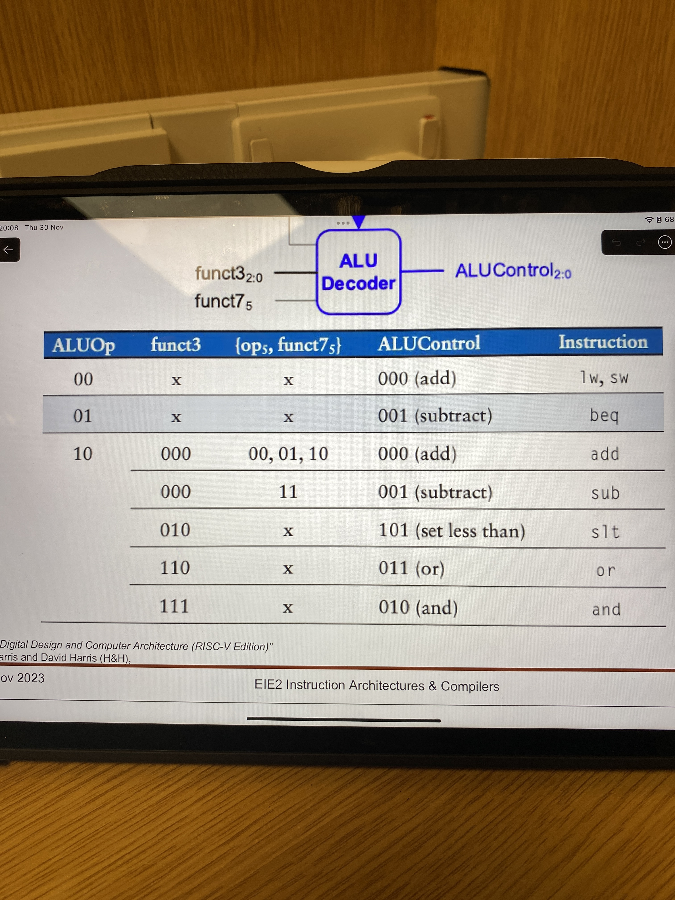
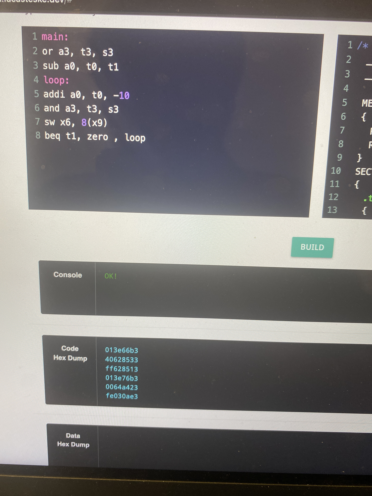
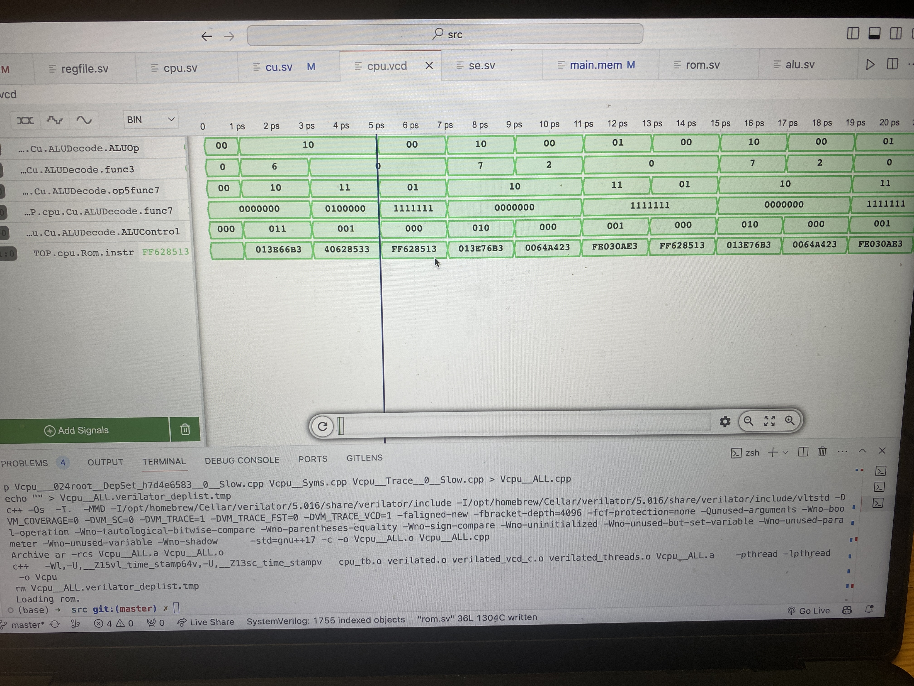
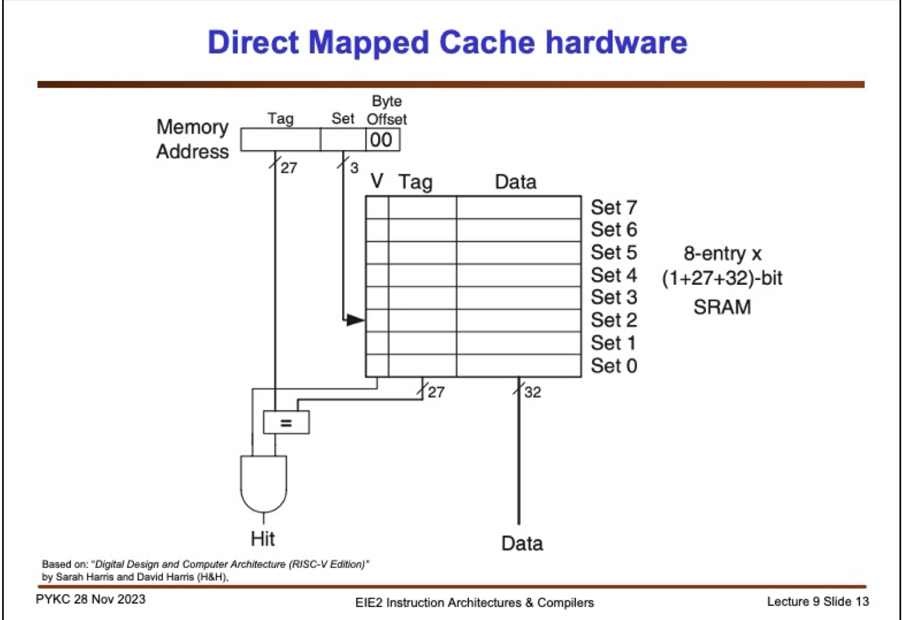

# Adam El Jaafari - Personal Statement
___

# Overview
- [**PC**](#pc-and-byte-addressed-instruction-memory)
- [**Instruction memory**](#instruction-memory)
- [**Initial CU with ALU Decode**](#initial-cu-with-aludecode)
- [**Debugging and initial JAL decode logic**](#debugging)
- [**Testbenches for most components I made**](#test-benches-for-most-components-i-made)
- [**Initial Pipeline Registers**](#pipeline-registers)
- [**Direct Mapped Cache**](#single-cycle-direct-mapped-cache)
___ 

## PC and Byte addressed Instruction memory
### Commit - [(e4aba55)](https://github.com/TheRealGlumfish/Team20/commit/e4aba55dcabe68d1e627c2f829add5d4605561de)
I created the initial program counter and byte addressed Instruction memory unit - this included my testbench "PC_tb.cpp" which i used to print the instruction data at each address, to verify both modules worked.
### Program Counter
The logic behind the initial program counter in the beginning was quite simple, if there is a rst signal then reset the program counter to 0, else if PCSrc=1 then PC = PC + imm if PCSrc=0 then PC = PC +4.
### Commits - [(8a34d92)](https://github.com/TheRealGlumfish/Team20/commit/8a34d92d873b0964a481bd11399af6549bc0e1fc) and [(6b0b82f)](https://github.com/TheRealGlumfish/Team20/commit/6b0b82fa737fb0b2986d670840a378661d4461d7)

Later the program counter had to be changed to accommodate for JAL and JALR type instructions. My initial implementation (Later improved upon and modified by Toby Browne), was to find out in the control unit, whether we have a JAL or JALR type instruction through the opcode of the instruction.
I assigned a signal within the main decode module (Jump) to be 1 if we have a JALR or JAL instruction, and a JALR flag within the cu to tell if we have a JAL type instruction. Within the main decode i also had to modify the logic behind the control signals to take into account in we have a JAL or JALR type instruction, so that when we have a JAL the value of pc+4 gets stored in the target reg and jump is taken, i did this by setting PCSrc =1 if we have a branch or jump . My logic for JALR was if the JALR flag =1 then in the program counter, we have a signal called target that we set to the aluout value, and the program counter would equal the aluout value. This is because the JALR instruction loads the value of the source reg + the offset into the pc, and so we jsut need to feed the ALU value into the pc and do what we did before with JAL and store the pc +4 in the destination register. JAL instructions worked however JALR did not work fully.
Later Dimitris and Toby modified the CU and found a more efficient method to implement JAL and JALR, however we still use the same principles that we have a JALR flag coming from the cu and if this is high then we load the aluout value into the program counter.

### Instruction Memory 
### Commits [(0587ea9)](https://github.com/TheRealGlumfish/Team20/commit/0587ea9b69b5ba94a4e103e0ef6a7bf394a7bc6f)
Readme from commit [(e4aba55)](https://github.com/TheRealGlumfish/Team20/commit/e4aba55dcabe68d1e627c2f829add5d4605561de)
- Allocated a ROM array (read-only memory) with 2^10 8-bit memory locations (same as having 2^8=256 32-bit memory locations).
- Ignores the last 2 bits of our PC, as we need to make this byte-addressed.
- Byte addressing: Each instruction is made of 4 addresses, and these addresses are offsets of the `addr` value. The list below associates the offset value and its corresponding instruction byte value.
    - Offset 0: byte 3 (MSB)
    - Offset 1: byte 2
    - Offset 2: byte 1
    - Offset 3: byte 0 (LSB)
- Through the concatenation of these bytes, we reconstruct our original instruction.
- **The instructions must be spaced according to their bytes** , since if the instruction is not byte spaced ,the `readmemh` part in rom.sv will read the last bytes of 4 subsequent instructions, instead of all the 4 bytes that make up 1 instruction, since it expects each byte to have spacing between another ,this is because in the rom.sv unit it is told to expect data of width 8 bits in each address, to distinguish between bytes. This is important so keep this in mind.
Later to accommodate for how the assembler produces the hex code, the byte addressing offsets had to be swapped (MSB offset= 0 and LSB offset =3 ), however the principle of byte addressing remained the same.
Toby Browne later added the memory mapping to the instruction memory.

### Initial CU with ALUDecode
Archisha and I worked on the initial CU (Toby and Dimitiris later refactored the CU and it more expandable and better which was needed the more the cpu was worked on). 
The initial CU can be seen in this commit - [(f491024)](https://github.com/TheRealGlumfish/Team20/commit/f4910248c26d9cbf14a81ff33f3fc05581ebadd7), initially ternary operators were used since we hadn't implemented many instructions, also beq and bne had to be handled by their func3 and depending on the instruction the Zero flag would be interpreted differently and so PCSrc would have to be calculated differently for both instructions (see commit) . I worked on the ALUDecode logic, where i take the func3 , func7 ,opcode and ALUOp from the cu and main decode and output the ALUCtrl signals for the respective instructions which was fed into the ALU. For this module i just followed Lec 7 slide 19 - [(3eae4eb)](https://github.com/TheRealGlumfish/Team20/commit/3eae4eba80f85e8439c9f237ca209eb26ca5a9aa)
 

  
instructions:
  

  
1)or
2)sub
3)addi
4)and
5)sw  
6)beq

For each (respectively) Expect alucontrol:
011
001
000
010
000
001

  

(Program loops back to loop label)

Verified by trace above

### Debugging (we all did at some point)

There were quite a few issues with the single cycle CPU and so Toby Archisha and I were in person debugging the CPU, checking the traces in gtkwave and looking into if a signal is incorrect, where does it come from and how is it calculated and what is the logic that should drive that signal, ironing out bugs and errors, e.g in this commit by Toby [(5aaf372)](https://github.com/TheRealGlumfish/Team20/commit/5aaf37200038d7736852a13f325428b1caba1d2a)
we realised that our pc was also adding the memory map value, which was not needed since the aluout value had this memory value correction anyway.

### Test Benches for most components I made

I've included code of the test benches  i've made, i did not upload them since it was not necessary to clutter our git repo, however before pushing any units (except for the pipeline registers which I initially did before we started pipelining).

For example for the ALUDecode module, i loaded instructions(seen above) and verified the ALUCtrl signals were correct, but in the beginning of designing the module I had a test bench that i would check specific values of ALUop,func3,func7 and opcodes for 
```ALUDecode.cpp 
#include "verilated.h"
#include "verilated_vcd_c.h"
#include "VALUDecode.h"
#include <chrono>
#include <cstdio>
#include <thread>
#include <iostream>

#define MAX_SIM_CYC 800
/*    input logic [6:0] op,
    input logic [2:0] func3,
    input logic [6:0] func7,
    input logic [1:0] ALUOp,
    output logic [2:0] ALUControl,
)*/
int main(int argc, char **argv, char **env){
    int simcyc;
    int tick;

    Verilated::commandArgs(argc, argv);
    VALUDecode* top = new VALUDecode;
    
    Verilated::traceEverOn(true);
    VerilatedVcdC* tfp = new VerilatedVcdC;
    top->trace(tfp, 99);
    tfp->open("ALUDecode.vcd");

    //init vbuddy

    // set rotary button to "one-shot" mode

    //initialise simulation inputs
    // run simulation for MAX_SIM_CYC cycles
    
    top->ALUOp=0b10;
    top->func7=0b0100000;
    top->op=0b0100000;
    top->func3=0b111;
    

    for(simcyc = 0; simcyc < MAX_SIM_CYC; simcyc++){
        for (tick = 0; tick < 2; tick++){
            tfp->dump(2 * simcyc + tick);
            top->eval();
        }

        std::cout<<int(top->ALUControl)<<std::endl;

        // rotary encoder can be used to slow simulation


        if((Verilated::gotFinish())) {
            tfp->close();
            exit(0);
        }

    }
    tfp->close();
    exit(0);
}

```
After I mainly used the instruction memory to do testing since modifying the hex for each signal became too tedious to test with, so later I would integrate my designs with the current cpu we had , and check what breaks and how i can make things work together.

For the initial CU i tested this with my test bench which can be seen at `CU_tb.cpp` commit - [(8e215ff)](https://github.com/TheRealGlumfish/Team20/commit/8e215ff86ba79a86665379dc7ff697210664dc91)

I had a very simple test bench where i would test the control signals for each instruction and verify for , this was tedious however in the beginning we didn't have many instructions so it wasn't too much of a hassle.

```
#include "Vcu.h"
#include "verilated.h"
#include "verilated_vcd_c.h"
/*
   input  logic             clk,      // clock 
   input  logic             rst,      // reset
   input  logic             PC_CTRL,      // Program counter control (from control unit, do we branch or move to the next address, ie pc=pc+imm or pc=pc+4)
   input  logic [WIDTH-1:0]   ImmOp,  //Immediate value to add to current PC val
   output  logic [WIDTH-1:0]   PC,  //next pc after next clk cycle (prev clk if no in next clk cycle)
   */
int main(int argc,char **argv, char **env){
    int i;
    int clk;

    Verilated::commandArgs(argc, argv);
    //init top verilog instance
    Vcu *top = new Vcu;
    //init trace dump

    Verilated::traceEverOn(true);
    VerilatedVcdC* tfp=new VerilatedVcdC;
    top->trace (tfp,99);
    tfp->open ("Vtop.vcd");


    top->instr= 0b1100011;
    top->Zero=1;

    for (i=0; i<40; i++){

        for (clk =0; clk<2; clk++){
            tfp->dump (2*i +clk);
            top->eval ();

        }


        if(Verilated::gotFinish()) exit(0);

    }

    tfp->close();
    exit(0);

}

```

I did not make testbenches for the other modules i made like the direct mapped cache and pipeline registers , since the best way I found to test if they work is to connect it to our original cpu and see what breaks and reverse engineer the module, depending on the signals from traces.

### Pipeline Registers

I made the initial pipeline registers which can be seen here - [(b8cade9)](https://github.com/TheRealGlumfish/Team20/commit/b8cade9a9a31ca8542d184cc318da4ebc3efbfaf)
This was mainly done just following the lecture slides and seeing what data path and control path signals need to pipeline from one stage to another. Toby later took responsibility for pipelining and modified these registers to account for the specifics of our cpu design. Though i felt it was important to get a good model for the pipeline registers completed and pushed onto the repo so pipelining didn't take too long.


### Single Cycle Direct mapped Cache

### Commit - [(f7afcfa)](https://github.com/TheRealGlumfish/Team20/commit/f7afcfac2f508b602833e22613c01c554dcddd61)

I began the design process of cache by following the image on lecture 9 slide 13. My main approach was to input 2 control signals, one control signal that will enable the cache (want to use cache) when we have a memory type instruction and another control signal that tells us when we want to write to cache , this signal is the exact same as the mem write signal that we use for writing to data mem, so we can just feed this into cache.The main aspects of cache is to take the tag field , of the address of memory we want to access, and the set field of the address of memory we want to access, and check if at that set field address of cache, if the tags equal and if the final bit of cache 1 (is it valid/ not garbage), my implementation of cache made reading from cache (if hit) asynchronous, I also added the datawidth part from our cu that tells us the width of data we read and write (from ram) into cache and so the cache allows lb, lw, lhw, sw, sb, shw type instructions. There are two times where i thought we want to write to cache, either when we have a store type instruction in data mem , because we'd also write / store what we want to in data mem into cache (to keep the latest version of memory at that tag/address in cache) . The other time we want to write to cache is if we've had a miss, and so we write the data that we should have had (which will be taken from ram) into the data field of cache, and update the valid and tag fields to the 1 and the tag field of the input address of data respectively. I had issues with the tags being delayed by one clk cycle and the way i found to solve this issue is to write when we have a store type instruction, we write on the +ve clk edge, and if we miss, we write on the -ve clk edge, my reasoning for this is because the latest ram value for that instruction will appear in the +ve clk edge and so cache will only see that value on the -ve edge, I don't know fully if my reasoning is valid but it fixed the issue of the input tag and current cache tag from being misaligned by 1 clk cycle. I also parametrised the ram so that it can be easy to change how many cache blocks we would like to have , without impacting the set and tag logic [(f7afcfa)](https://github.com/TheRealGlumfish/Team20/commit/f7afcfac2f508b602833e22613c01c554dcddd61) . The cache i implemented was not 100% complete, the hit rate was way too high, as i was not taking into account missing incases of non-word aligned access, Dimitris improved upon my direct mapped cache and solved these issues.
