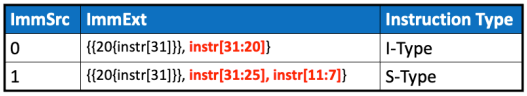
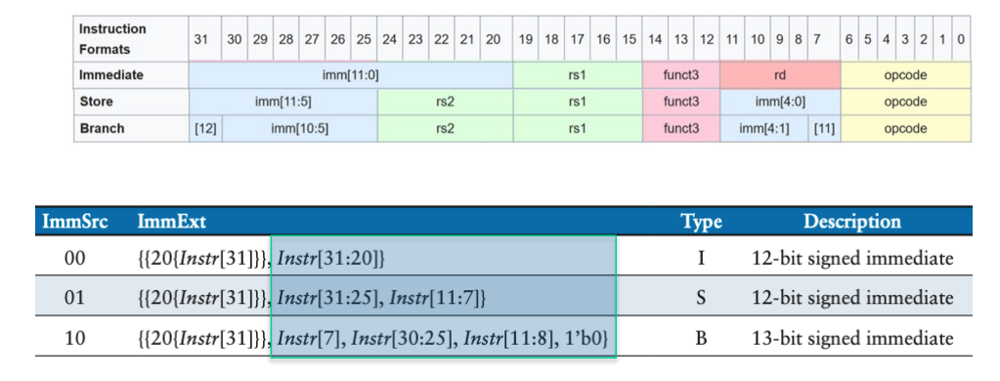
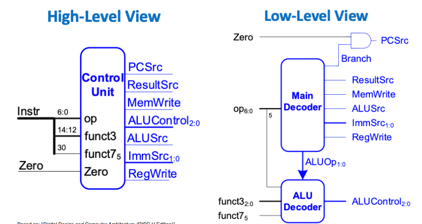
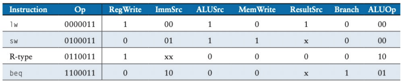
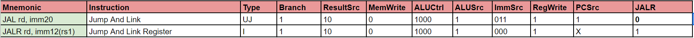
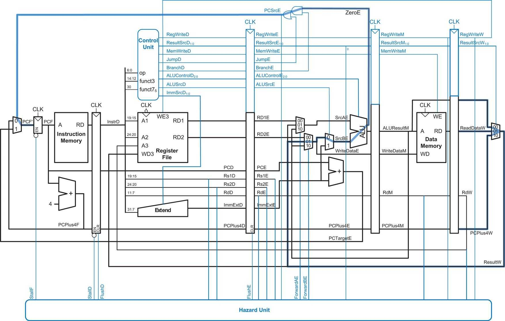

<center>

## RISC-V Processor Coursework

---
## Personal Statement of Contributions

**_Archisha Garg_**

---

</center>

## Overview

* Sign extension unit 
* Control Unit
* Jump Instructions
* Hazard Unit
* Pipelining
* Cache
* Additional Comments

<br>

___

## Sign Extension Unit
___

Relevant Commits:
* [Modified ImmSrc to be 2 bits](https://github.com/TheRealGlumfish/Team20/commit/04c45560ec1b748c9e46bd0184fc669c819d6193)
* [Modified ImmExt to be 32 bits](https://github.com/TheRealGlumfish/Team20/commit/f04898fc080121f2c32890299c7bb39f9a258d54)
* [Added LUI instruction case in se and changed ImmSrc to 3 bits](https://github.com/TheRealGlumfish/Team20/commit/ad2d5d92f6429d9b93cc9589a967de023ec349e9)


I created the sign extension for lab 4 and also for the single cycle CPU. The initial modification was to change `ImmSrc` into 2 bits compared to 1 bit to include the B-type instruction as shown below from the lecture slides:
<p align="center">  </p><BR> 
<p align="center">  </p><BR> 

I had to implement the `jal` instruction and the jump target address (`PCnext`) had to be PC + the 21 bit signed signed immediate. The least significant bit had to be set to 0 and the rest 20 came from the Instruction (Instr[31:12]), therefore the code for this was: 
```signextend
case(ImmSrc)
//other cases for other instruction types
2'b11:
    ImmExt = {{12{Instr[31]}}, Instr[19:12], Instr[20], Instr[30:21], 1'b0}; 
```
Finally, the `ImmSrc` had to be changed to 3 bits to include the case for the load upper immediate (U-type) instruction. This required the 32 bit immediate with the upper 20 bits from the instruction and the lower bits to be 0's so the code for this was: 
```signextend
case(ImmSrc)
//other cases for other instruction types
3'b100:
    ImmExt = {Instr[31:12], 12'b0};
```
A default case (which should not be reached) was also added since not all cases for the 3 bit `ImmSrc` were defined. 

<br>

___

## Control Unit
___

Relevant Commits:
* [Created Main decode and combined with ALU decode to create CU](https://github.com/TheRealGlumfish/Team20/commit/04c45560ec1b748c9e46bd0184fc669c819d6193)
* [Updated maindecode for ResultSrc, MemWrite, 2 bits ImmSrc](https://github.com/TheRealGlumfish/Team20/commit/5fcaaa55b3a1da3352f93b04d9c94c8027869014)
* [Set default 11 for ImmSrc](https://github.com/TheRealGlumfish/Team20/commit/57a5446f203c4547b51d5558d3c638d01eaa7254)
* [Included I type instruction logic](https://github.com/TheRealGlumfish/Team20/commit/fff9755c6c7fd85e6a7d6d86cc3c9bf7cf2bd8bf)
* [Included JALR instruction](https://github.com/TheRealGlumfish/Team20/commit/be4bc6ab4e6db04e95cda745d26687f11d6f587f)
* [Changed CU to only one cu.sv file](https://github.com/TheRealGlumfish/Team20/commit/b041f33cd6b3f6ed0947f418a0c267edca986023)

Initially, I created the main decode block inside the control unit which was then combined with the ALU decode block (written by Adam) using a top control unit module as shown in diagram:

<p align="center">  </p><BR> 
I set the outputs from the maindecode (ResultSrc, MemWrite, ALUctrl, ALUSrc, ImmSrc, RegWrite, PCSrc) as shown in the tables below for the required instructions:

<p align="center">  </p><BR> 
<p align="center">  </p><BR> 

[Link to module maindecode.sv](https://github.com/TheRealGlumfish/Team20/blob/cu/rtl/maindecode.sv)

This was tested and it worked for all the instructions except for JALR (for which we had to include a flag as explained in the next section). 

Finally, we decided to have only one `cu.sv` file rather than 3 (maindecode.sv, ALUDecode.sv, cu.sv) as there were not enough bits to implement all the ALU instructions, it was also neater and allowed us to debug faster. Therefore, all the code from maindecode was copied into the cu.sv file with a structure such that it was clear where the code for each instruction/ type of instruction came from. 
___

## Jump Instructions
___

Relevant Commits:
* [Worked on JAL/JALR logic](https://github.com/TheRealGlumfish/Team20/commit/ff427db7571c20ab5e9848e5e8f461f1aaf131f5)
* [Included JALR instruction in CU](https://github.com/TheRealGlumfish/Team20/commit/be4bc6ab4e6db04e95cda745d26687f11d6f587f)

JAL is a J type instruction while JALR is I type and these required some extra logic to work.

We had to include flags for `JAL` (J-type) and `JALR` (I-type) instructions in the control unit and also the top module CPU. This allowed us to set `PCSrc` to 1 when there is a jump instruction so that the mux for `PCNext` can select from `PCTarget` and is therefore able to jump to the required address specified in the instruction. When the JALR flag was high, the value from ALUout was loaded into the program counter so that the loaded value is the source register + the offset as required. This is shown in the diagram:

<p align="center">  </p><BR> 
___

## Hazard Unit
___

Relevant Commits:
* [Created Hazard Unit](https://github.com/TheRealGlumfish/Team20/commit/77eddb8398901ad8f2513df58ddf5f421684f788)
* [Updated with correct logic](https://github.com/TheRealGlumfish/Team20/commit/6c512356eb12e11b8c2859233312946366f5d34e)
* [Included JALR flag in hazard unit](https://github.com/TheRealGlumfish/Team20/commit/da7089d74617a440ae77f5e14a4fba20add78744)

I created the hazard unit with inputs and outputs using the following diagram: 
<p align="center">  </p><BR> 

I used logic for stalls and flush using information from the lecture slides and textbook. 
This unit consisted of 3 parts: 
1. Data Forwarding (`ForwardAE`, `ForwardBE`) which determines if there is a data hazard in the execute stage by comparing the source register with the destination registers from stages such as memory and write-back. It helps in forwarding data to the execute stage directly from the memory or write-back stage, bypassing the need to wait for the regular pipeline flow, thus reducing stalls.

2. Stall Control (`StallF`, `StallD`) which detects hazards caused by load instructions (`lwStall`) by checking if the operands of the current instruction match the destination registers of the previous load instruction. If there's a match and the previous instruction intends to write to registers (`MemtoRegE`), it causes a stall to prevent incorrect data forwarding.

3. Pipeline Flush (`FlushE`, `FlushD`) when a jump or branching instruction is detected, signals to flush the pipeline stages, or in case of a load hazard (`lwStall`).

___

## Pipelining
___

Relevant Commits:
* [Included JALR in pipeline](https://github.com/TheRealGlumfish/Team20/commit/da7089d74617a440ae77f5e14a4fba20add78744)

I helped in pipelining by including the JALR instruction using different flags `JALRE` and `JALRD` for the different execute and decode stages. 

JALRE is an output signal from the hazard module. It is set to 1 when a JALR instruction is detected in the execute stage. This flag indicates to the decode stage that a JALR instruction has been executed. It influences the `FlushD` signal, indicating whether a flush is required in the decode stage due to a JALR instruction in the execute stage. This is shown in code as:

```hazard
FlushD = (PCSrcE | JALRE)
```
In the `decodeff` module, JALRD is an input signal. On a positive clock edge, if clear is not active, JALRD is transferred to JALRE, allowing the state of the JALR flag to pass from the decode stage to the execute stage.

___

## Cache
___

Relevant Commits:
* [Created two-way cache](https://github.com/TheRealGlumfish/Team20/commit/2e53c2166b46785e03c45ca9fd98ee656b3f0e3a)

I upgraded the one-way cache into two-way using the lecture slides to understand the differences and I implemented these in code. The main changes were that two-way uses two arrays to store the cache blocks (Each block is represented by `cacheblocks1[set_i]` and `cacheblocks2[set_i]`) and each of these contained a tag and validity information, hits in both sets checked before accessing data, stores data from memory into both cache blocks of the respective set on a miss. 

I included `Hit0` and `Hit1` which detect whether the address is present in either set of cache blocks (cacheblocks1 or cacheblocks2). Hit combines the hits from both sets using the code:

```cache2
Hit = (Hit1 | Hit0)
```
If a hit (Hit == 1), it selects the appropriate cache block data based on the `DataWidth`.
If a miss, it outputs data from the memory (`ramdata`).
The always_ff block manages cache writes: It checks for the availability of a cache/mem type instruction (`cacheEn`).
If a write operation (`wen`) is enabled: It determines the type of data write (`DataWidth`) and updates the respective cache blocks with the new data and tag information.
On a cache miss (Hit == 0), the module writes the data from memory (`ramdata`) into both sets of cache blocks at the given set index. 

I used the following diagram from the lectures to implement this:

<p align="center">  </p><BR> 

This cache design efficiently uses set-associative mapping to improve hit rates by allowing multiple blocks to reside in the same set, offering more flexibility compared to direct-mapped caches.

However, we did not have enough time to test this and therefore it is incomplete.
___

## Additional Comments
___

In addition to the contributions mentioned above, I helped in debugging and understanding certain areas to help create the code. Some examples:

* [Commit by Toby:](https://github.com/TheRealGlumfish/Team20/commit/5aaf37200038d7736852a13f325428b1caba1d2a) In this, we noticed that the `pc` added the memory map value althought we already added this in the `aluout`. 

* [Commit by Adam:](https://github.com/TheRealGlumfish/Team20/commit/6b0b82fa737fb0b2986d670840a378661d4461d7) In this, we noticed that the `ResultSrc` had not been changed from 1 bit to 2 bits in the control unit. Also, an intermediate `BranchAndZero` was added which was equal to the branch value AND Zero flag so that this can be put through an OR gate with the jump flag to change `PCSrc`.
