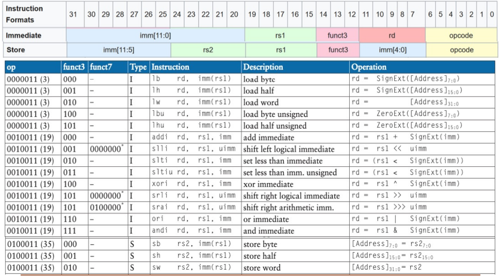
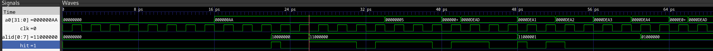

# Dimitris Alexopoulos (@TheRealGlumfish) - Personal Statement
---
## Overview
- [**Register File**](#register-file)
- [**ALU**](#alu-arithmetic-and-logic-unit)
- [**Control Unit**](#control-unit)
- [**Memory**](#memory)
    * [Memory Mapped I/O](#memory-mapped-io)
    * [Cache](#cache)
- [**F1 Lights Program**](#f1-lights-program)
- [**Repomaster**](#repomaster)
- [**Conclusion**](#conclusion)
---
## Register File
https://github.com/TheRealGlumfish/Team20/blob/232045f4fa1b06537831d65f6331cc133ddbecd7/rtl/regfile.sv#L1-L34

The register file was the first module I created [(e04b48d)](https://github.com/TheRealGlumfish/Team20/commit/e04b48d8b42ebd4ae2d57acf921177a2d92ce467), starting during Lab4.
But I was also responsible for and continued maintaining it throughout the project.
It was fairly easy and I did not encounter many challenges.

The only interesting part was how to handle the `zero`/`x0` register.
Having the `zero` register be a normal register poses issues, because (at least in reality) a register cannot be written to twice in the same cycle.
This would pose an issue as if the register is written to by the ALU, it would need to be instantly set to zero again to conform to the ISA.
In the end the solution I settled on was having the regfile contain 30 registers instead of 31 and hard-wire the `zero` register.
When the register select lines `AD1` and/or `AD2` were selecting the `zero` register zero would be outputted to `RD1` and `RD2` respectively.
Writes while `zero` was selected also did nothing (which is the correct behavior as per the ISA).
When any other register was selected, the register was accessed from the `registers` "array".
The index had to be offset by -1 as there was one less actual register in the `registers` "array".
This led to the correct behavior [(8612d56)](https://github.com/TheRealGlumfish/Team20/commit/8612d564800849b0fa6ffcedcfd5cdd0a8e47c71), [(0da1dd3)](https://github.com/TheRealGlumfish/Team20/commit/0da1dd3d7a3ab50a90e3b0d43608fc16a95915e7).

---

## ALU (Arithmetic and Logic Unit)
https://github.com/TheRealGlumfish/Team20/blob/729bc1d2dc56a0c9f65dc3fbdfd498d9bafcaccf/rtl/alu.sv#L1-L48

The ALU was the second module I created [(2b6210b)](https://github.com/TheRealGlumfish/Team20/commit/2b6210b704cae09d5a97687c8588cc7079b9337d) (again during Lab4) and then maintained and developed throughout the project.
Initially the ALU only supported addition and the equality flag to support `addi` and `bne` needed for Lab4.

It was then expanded with more operations and a control signal `ALUctrl` to switch between them [(0da1dd3)](https://github.com/TheRealGlumfish/Team20/commit/0da1dd3d7a3ab50a90e3b0d43608fc16a95915e7).
Since the ALU has less operations than potential values in the `ALUctrl` signal, the default case will cause it to output `0xDEAD` if the signal doesn't have a valid value.
This was the first instance of using magic numbers for debugging invalid control signals and was useful throughout other parts of the project.

The ALU did not always support all the operations of the ISA as `ALUctrl` was originally 3-bits due to the use of an ALU decoder module.
The values for `ALUctrl` were also chosen arbitrarily to conform with the control unit, which made expandability difficult.
Once the control unit was reworked and the decoder was removed, `ALUctrl` was made into a 4-bit signal, which meant all the ISA arithmetic and logical operations could be supported [(aef8ccf)](https://github.com/TheRealGlumfish/Team20/commit/aef8ccf1e72682f6c509b147ce504f559e7afbb4).
This also gave rise to the `ALUctrl` values being the `funct3` values of the relevant instructions which meant no custom value-operation pairings had to be created and the values the ISA has standardized can be used.
This made it much easier to keep track of the control signals.
The MSB of `ALUctrl` was used to distinguish between operations where `funct3` is the same, such as `add` and `sub`, `srl` and `sra`.

One of the challenges I had when implementing the ALU was how to handle the signed/unsigned set less than.
With the help of my teammate @tobybrowne we were able to figure it out [(49f2e6d)](https://github.com/TheRealGlumfish/Team20/commit/49f2e6d1b9253a89c54992b0742cf6cb97b484b8), with a final fix by @tobybrowne [(382bc15)](https://github.com/TheRealGlumfish/Team20/commit/31c86d2607695f7e8).
Testing the ALU was fairly simple as the operations do not involve any state.

---

## Control Unit
https://github.com/TheRealGlumfish/Team20/blob/729bc1d2dc56a0c9f65dc3fbdfd498d9bafcaccf/rtl/cu.sv#L1-L181

The control unit was a module that my teammates @AElja and @Archisag23 originally worked on.
My involvement began when I wanted to implement the full range of ALU operations, which at the time were not supported as the `ALUctrl` signal was not set to the right values.
While setting the `ALUctrl` signal to support the added instructions I realized that I did not have enough bits in the signal to represent all the ALU operations.

This is when I tried to extend the control unit and quickly realized it wasn't very extensible, using a lot of hard-coded logic.
This is where me and my teammate (who wanted to get all the jump instructions working) @tobybrowne started to look at how we can rework the control unit.
He made a spreadsheet with all the values for the various control signals like `MemWrite`, `RegWrite`, etc.
I then looked at what patterns we can find in the instruction set, particularly in regards to I-Type and R-Type instructions which rely on the ALU.
Unsurprisingly (especially how RISC-V is based on the principle that "Simplicity favours regularity"), I managed to spot a few patterns using the following table.


Firstly, all R-Type instructions have the same opcode, the same pattern follows for all distinct categories for instructions.
This is the first way we differentiate what logic follows in the CU and how instructions are decomposed.
Secondly, all the different ALU operations are distinguished by the value of `funct3`.
Thus, `funct3` was directly used as ALUctrl.
The only problem is that `add` and `sub`, as well as `srl` and `sra` have the same `funct3` value.
They are differentiated by bit-5 of `funct7`.
Thus `funct7[5]` and `funct3` were combined to form a 4-bit ALU control signal.



I-Type instructions followed the same pattern, therefore, the same logic was used.
This allowed us to implement a much simpler and more readable control unit that was a lot easier to debug as all the instruction types were handled separately in each case, and the common patterns from each instruction type were extracted and used to simplify the control unit logic.

Having made these discoveries and with the help of my teammate and the spreadsheet he had created, I rewrote the control unit from scratch with no separate decoder modules [(aef8ccf)](https://github.com/TheRealGlumfish/Team20/commit/aef8ccf1e72682f6c509b147ce504f559e7afbb4), [(084e9ee)](https://github.com/TheRealGlumfish/Team20/commit/084e9ee2e0677fadec1be0822816c87f8f22cf03), [(7c10a38)](https://github.com/TheRealGlumfish/Team20/commit/7c10a3821896fbd2b07d18a90ea0b97623f39aa7), [(73e5bba)](https://github.com/TheRealGlumfish/Team20/commit/73e5bba2b392c0068fd0eac87bcaad4cd75215a9).
The result was being able to support all instructions with the exception of `auipc` but more importantly a control unit that was much more maintainable and easier to pipeline and connect to cache.

---

## Memory

### Memory Mapped I/O

https://github.com/TheRealGlumfish/Team20/blob/729bc1d2dc56a0c9f65dc3fbdfd498d9bafcaccf/rtl/datamem.sv#L1-L99

```SystemVerilog
if(addr > 32'hBFC00FFF)
begin
    if(addr == 32'hFFFFFFFF) 
        dout = ioin1;
    else // should be used with 0xFFFFFFDF
        dout = ioin2;
end
```

For the F1 lights program, a trigger signal was required which could be implemented a number of ways such as memory mapped I/O or a I/O register (like `a0` but for input).
I choose to do memory mapped I/O (in this case only input).
I did this by creating two lines in the data memory and top-level cpu module `ioin1` and `ioin2` which were both a word wide [(62a04e7)](https://github.com/TheRealGlumfish/Team20/commit/62a04e7b49e2e2a31f45c4efc067c665d0601129), [(afeb425)](https://github.com/TheRealGlumfish/Team20/commit/afeb4255f20ebcb8ae266e1f47ac3f38717bae18).
These were mapped to the addresses `0xFFFFFFFF` and `0xFFFFFFDF` respectively as its unused space in the memory map.
The memory addresses are not word aligned which disables (forces a miss) in the cache as this would cause cache/memory inconsistencies.
Thus, all the programmer has to do to access the value of these signals from assembly code is simply load from these memory addresses.
This makes for a simple and easy to use interface for the programmer as well as being asynchronous.
The logic for this is seen in the code block above.
All that had to be done is connect the memory output to the signal `ioin1` or `ioin2` depending on the addressed accessed.
More input signals could be easily added by making the `if` statement a case with different addresses, thus making this approach for I/O very expandable without much additional hardware/HDL code.

### Cache

https://github.com/TheRealGlumfish/Team20/blob/ed2cd26788e19efcbd5ba0510957f485e3e289e3/rtl/cache.sv#L1-L105

My second contribution to memory was refactoring the cache that my teammate @AElja made.
When I was testing the cache I was encountering some problems so I decided to refactor the module from the ground up to fix the issues and also make it more readable, as well as gain a better understanding on how it worked.
My design ended up being very similar to his, with the exception of the new caching policy that I implemented [(83d48ce)](https://github.com/TheRealGlumfish/Team20/commit/83d48ce1e3fa1ad458490adb6e02dc47c422c775).
During writing the cache I realized that memory addresses that were offset by between `0b0011` and `0b0001` (addresses are 32 bits but leading bits are 0s so they have been omitted for the sake of readability) would be treated as the same by the cache as they would have the same tag and set number, as the last two bits of the address are discarded (the so called "byte offset").
This could cause the cache to give out incorrect data if the cpu requests address `0b0000` and `0b0001` the cache would give the same cache line for both even though they could contain different data (the last and first byte of the word).
Thus, I added a policy of considering any unaligned (non-word aligned) memory access a cache miss.
If the cpu attempted to write to memory in an unaligned fashion and the cache contains that word, (same tag and set), the cache line will be invalidated to prevent memory/cache inconsistencies.
Additionally if two adjacent cache lines (consecutive cache sets) contain contain consecutive memory words, both cache lines are invalidated to prevent data in memory having changed and cache being out of sync.
The logic that controls this is the following.
```SystemVerilog
    logic aligned;
    logic hit;

    assign aligned = addr[1:0] == 2'b00; 
    assign hit = (aligned && ctag == itag && cvalid);

    always_ff@(posedge clk)
    if(wen && cache_en && !aligned) // if unaligned write, invalidate current set
    begin        
        if(cache_tag[iset] == itag) // if the cache holds part of the word, the word must be invalidated
        begin
            cache_valid[iset] <= 0;
            if(cache_tag[iset] == cache_tag[iset + 1]) // if two adjacent sets share the same tag, it means they are adjacent words and must be both invalidated
                cache_valid[iset + 1] <= 0;
        end
    end
```
This policy of not using cache for unaligned access means that memory mapped I/O is not cached which is what we want to happen, as the inputs `ioin1` and `ioin2` change independently of writes and thus would be out of sync.

This approach of dealing with unaligned memory access has certain tradeoffs as it means unaligned memory accesses are penalized (and would be slower in real hardware where memory is slow, since they miss the *fast* cache).
Another way to solve this issue is make the set field wider or make it include the byte offset field in the set field.
This would cause unaligned words to be cached but it would mean that a lot less of the address space would be mapped for the same size of cache, as the words overlap.
Thus, they would mostly stay unutilized and empty as unaligned memory access is rare in most programs (as its usually significantly slower on real hardware and is discouraged by the ISA designers, even though its supported and legal).
Thus, the solution implemented was the better tradeoff for most situations.

https://github.com/TheRealGlumfish/Team20/blob/0fe43279515142c183cca432072dbb0100b8bf93/rtl/cache.s#L1-L27

In order to test the cache I wrote a test program which loads into memory and then repeatedly accesses the same addresses to see if they get cached.
It also tests for unaligned access and cache invalidation.
Markers are inserted in the traces by setting the `a0` register to different magic numbers such as `0xDEAD`.
The trace can be seen below, where `hit` goes high when there is a cache hit, and bits (in the HDL code it's an array but GTK Wave treats it as a multibit signal) of `cache_valid` go to zero when there is an invalidation.



Please note that if `hit` is high for only the second half of a clock cycle it means there was a miss and the data was cached to prevent future misses (as populating the cache happens on the negative edge of the clock cycle).
A true hit means `hit` is on both for the high and low part of a clock cycle (both positive and negative edge).
Hit being off for both indicates unaligned access.

---

## F1 Lights Program

https://github.com/TheRealGlumfish/Team20/blob/14a48822ee5550996d13e3d2ed1edbb2a4b1b358/test/f1.s#L1-L89

https://github.com/TheRealGlumfish/Team20/blob/14a48822ee5550996d13e3d2ed1edbb2a4b1b358/rtl/f1_tb.cpp#L1-L70


I was responsible for writing the F1 lights program as well as the accompanying test bench.
I initially wrote the program using simple jumps [(3aec028)](https://github.com/TheRealGlumfish/Team20/commit/3aec0282cc1abfb74ef20f8d95fb3daf70929c1b).
Which I then refactored to use subroutines as per the program specification [(45300e0)](https://github.com/TheRealGlumfish/Team20/commit/45300e0fe3190cfb466a789309ed66c8a5b1ec69).
I did not face any particular challenges when writing the program and I imitated the FSM operation from Lab3.
The enable signal was mapped to `ioin1` which must be held on for the lights sequence to continue.
In order to reset the sequence the enable must be released.
Evidence of the F1 lights program running on VBuddy can be found on our team statement.

---

## Repomaster

As the repomaster I had some additional responsibilities.
Due to that my contributions are more scattered than other members as a good part of my work was dedicated on quality assurance, formatting and refactoring code as well as maintaining the repository.
Thus, I have worked on most modules rather than dedicating my work on just one.

Part of my time was spent on merges and integration such as connecting and merging the cache with the pipelined CPU [(bd88bf8)](https://github.com/TheRealGlumfish/Team20/commit/bd88bf87bf74945c1f94ae5c8f0cf91b55a3032b).
Sometimes I utilized GitHub pull requests in order include the team in the review and merge process [(#7)](https://github.com/TheRealGlumfish/Team20/pull/7) and [(#3)](https://github.com/TheRealGlumfish/Team20/pull/3).
Small but crucial fixes were common [(0300d38)](https://github.com/TheRealGlumfish/Team20/commit/0300d383082b1d9f6776d9d8cc6cbef049b6a8d8), [(2097185)](https://github.com/TheRealGlumfish/Team20/commit/2097185328d0dc46aae8640628a24fbfdf41f1de), [(4aa3028)](https://github.com/TheRealGlumfish/Team20/commit/4aa3028e688677cba5434887177294b53a6a6d95), [(ce0b715)](https://github.com/TheRealGlumfish/Team20/commit/ce0b715929bff361126c797a471ded7da812ca9f), [(79697bc)](https://github.com/TheRealGlumfish/Team20/commit/79697bc4dd490a57b9c1468fc5fdb45eb993870b), which were often brought up by me or other team members during the testing and debugging process.

---

## Conclusion

In conclusion this was a very challenging but informative project.
Learning HDL design and SystemVerilog was extremely eye opening to a whole new area of electronics that I had not experienced before.
RISC-V was a pleasure to work due to its consistency and with even though implementing it was difficult and I hope to see it succeed in the world of embedded systems but also mainstream computing.
I managed to significantly strengthen my understanding of CPU design and operation which was lacking last year and now I feel a lot more confident in it.

One of the most valuable experiences I had during this project was using Altera (Intel) Quartus II to synthesize the CPU on a Terasic DE0 board utilizing a Cyclone III FPGA.
This was something I did independently on my free time but it gave me great insight for the project.
Not only did Quartus give me useful compiler and warnings errors that Verilator omitted, helping us strengthen our design against bugs.
It was just really interesting to see the CPU running on real hardware and also to deal with the problems that come with real hardware such as synchronous memory and propagation delays.

If I was going to do something differently for this project would be to have gotten involved in caching more early on as I originally was very intimidated by it but it turned out to be very interesting to work with.
Implementing more complicated caches would have been very interesting.
Upgrading the current cache's capabilities to deal with unaligned access would also be an improvement I would have made if it weren't for time constraints.
Although overall I am very satisfied and proud of the end result and the goals me and my team managed to achieve.

---

#### References

Diagrams and tables were used from the ELEC50010 Instruction Architectures & Compiler (IAC) -  Autumn Term 2023 module lecture slides by Professor Peter Y. K. Cheung.
