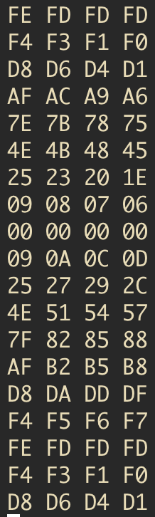
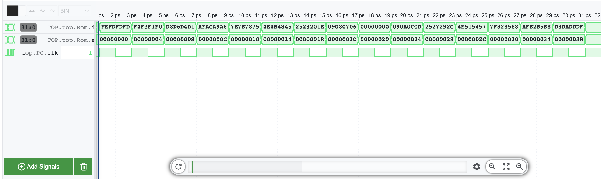

# Program Counter and Instruction Memory

## Notes:

- Allocated a ROM array (read-only memory) with 2^10 8-bit memory locations (same as having 2^8=256 32-bit memory locations).
- Ignores the last 2 bits of our PC, as we need to make this byte-addressed.
- Byte addressing: Each instruction is made of 4 addresses, and these addresses are offsets of the `addr` value. The list below associates the offset value and its corresponding instruction byte value.
  - Offset 0: byte 3 (MSB)
  - Offset 1: byte 2
  - Offset 2: byte 1
  - Offset 3: byte 0 (LSB)
- Through the concatenation of these bytes, we reconstruct our original instruction.

- **The instructions must be spaced according to their bytes** (see image below), since if the instruction is not byte spaced ,the `readmemh` part in mod.sv will read the last bytes of 4 subsequent instructions, instead of all the 4 bytes that make up 1 instruction, since it expects each byte to have spcacing between another ,this is because in the rom.sv unit it is told to expect data of width 8 bits in each address, to distinguish between bytes. This is important so keep this in mind.

The trace below can be cross referenced with the memory file screenshot above, the byte addressing does indeed work and so our memory is byte addressed.

